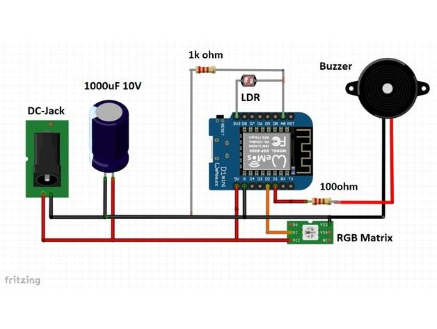

# **Elektronik**

Die Elektronik kann entweder auf Lochrasterplatine gelötet oder "fliegend" verdrahtet werden. (Platine wird in Zukunft eventuell noch für kleines Geld zu erwerben sein)

An der Matrix direkt zu löten kann fatale Folgen mit sich bringen, da das flexible PCB und vor allem die LEDs extrem Hitzeempfindlich sind. Lasst daher das Kabel am Eingang (DI,5V,GND) und schneidet nur den stecker ab. Sollte eure Matrix einen Ausgang haben (DO) so könnt ihr diesen auch getrost komplett entfernen.
Bevor Ihr die Buchse für die Spannungsversorgung fest verlötet, verschraubt Sie erst mit 2 angelöteten Adern am Gehäuse. Wie Ihr alles miteinander verlötet könnt ihr diesem Schema entnehmen:

