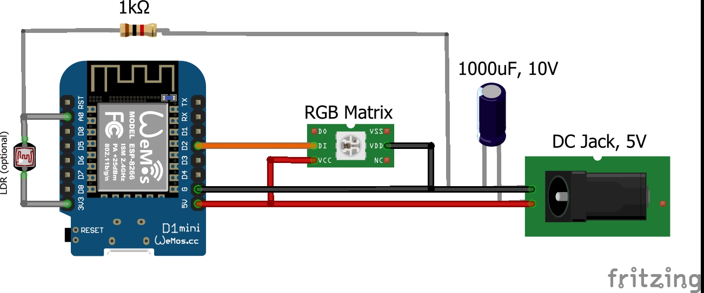

# **Electronic**

The electronics can either be soldered to a breadboard or wired "overhung". (PCB may still be available for a small fee in the future)

Soldering directly to the matrix can have fatal consequences, as the flexible PCB and especially the LEDs are extremely heat-sensitive. Leave the cable at the input (DI,5V,GND) and cut off only the plug. If your matrix has an output (DO), you can remove it completely.
Before soldering the socket for the power supply, screw it to the housing with 2 soldered wires. How you solder everything together can be seen in this scheme:

