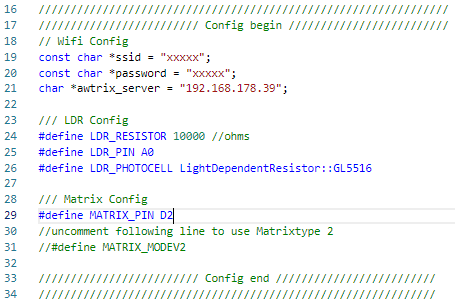

## **IDE**

Platform.IO is used to edit and upload the firmware.
The underlying IDE (Atom, Visual Studio Code) does not matter.
However, this manual is based on Visual Studio code and may need to be adapted.
The installation of the IDE is described in the following link:
[https://platformio.org/platformio-ide](https://platformio.org/platformio-ide)

## **Flashing**

The firmware can be downloaded here:
[AWTRIX Controller](https://blueforcer.de/downloads/awtrixcontroller.zip)


Unzip the ZIP file with a suitable unpacker and open the folder in Visual Studio code. Then simply flash the firmware. In VSC, this is done in the blue line at the bottom of the window:  


## **Setup**

Before flashing the Firmware, edit your wifi credentials and set the IP from the Server wich should run the serverapplication.  If you using a LDR for automatic brightness control, you also need to modify the LDR section.  


## **OTA Update**
- Setup your Firmware as described in the previous point
- Compile the Firmware [Buid].
- Open a Browser and call the AXTRIXCONTOLLER_IP
- Via [Browse...] select "PATH_TO_PROJECTFOLDER\awtrixcontroller.pioenvs\nodemcuv2\firmware.bin" and press [Update] 
- wait until the flash process is completed.

## **Troubleshooting**

If your Matrix shows weird Pixel and you cant read it, you have to change code and flash the Firmware again, by setting the Matrixmode 2:
- just uncomment (remove the first two //) following line in awtrixcontroller.cpp   
```//#define MATRIX_MODEV2```