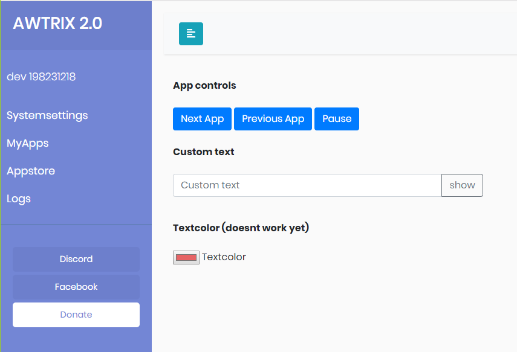
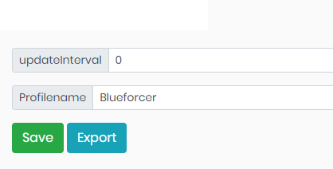

## **Webinterface**

In order to make the operation as simple as possible for everyone, the complete operation takes place via a web interface.
The standard port is 7000.

Here you can manage all your settings, manage your apps and download new one.

## **Systemsettings**
Here you will find all relevant settings concerning the operation of AWTRIX.

### General Settings     
- **verboseLog**
  - logging mode that records more information than the usual logging mode. 
- **switchAnimation**
  - Whether the transition animation between the apps should be displayed.
- **colorSwitch**
  - Another transition animation. 
- **uppercaseLetters**
  - Converts  all letters to capital letters.
- **textColor**
  - The global texcolor (Red, Green, Blue). All values can be from 0-255 and must be separated by a comma.
- **brightness**
  - The brightness of the matrix (0-255).
- **appDuration**
  - Time in seconds to change to the next app.
- **updateInterval**
  - Global interval in which all apps are updated. Exceptions are the apps that were manually overwritten (see MyApps).
- **scrollSpeed**
  - The speed at which the text is scrolled in milliseconds. (The lower the faster, default: 65).  
  
### Automatic Brightness   
- **autoBrightness**
  - Activates the automatic brightness control. (Only with LDR connected).
    
### Connections    
- **cloudActive**
  - Enables the cloud connection.
- **FritzCaller**
  - Enables the Fritz!Box Call monitor, and displays incoming calls.
    
?> The CallMonitor function on the Fritz!Box must be activated (e.g. by entering #96*5* on a telephone connected to the Fritz!Box).
You can also add your Fritz!Box phone book, by export it and [convert the xml to json](http://www.utilities-online.info/xmltojson/). Save it as "fritzbox.json" in the config folder. AWTRIX will show the caller names after restart.

- **webServerPort**
  - Port the Webserver listens to.
- **FritzBoxIP**
  - IP adress of your Fritzbox (needed for FritzCaller).  
   
### MQTT 
- **MQTTclient**
  - Connects AWTRIX to an existing MQTT Broker
## **MyApps**
The administration of all your apps takes place here.  
Here you can disable, configure or delete your apps  

Every App has its own updateInterval. If it is set to 0, it means that this app together with the other apps will be updated after a global period. (Systemsettings->updateInterval).   
This setting is sufficient for most apps not to exhaust the API quota.  
However, if desired, the interval at which the app fetches new data can be forced. Just enter a timespan in seconds (minimum 10s). 

## **Appstore**
AWTRIX has its own appstore.
Here all tested apps are provided and can be downloaded or updated.
After a download you find this app in MyApps.  
 
 **crypto**  
Shows prices for any cryptocurrency. Set your desired Coin and your currency.   

 **facebook**  
Shows your Facebooksite likes count.   
www.facebook.com  

 **fortnite**  
Shows your Kills, Wins, Wins% and K/D   
https://www.epicgames.com/fortnite/de/home  

 **gas**  
Zeigt dir die Spritpreise in deiner Naehe an.(Tankerkoenig API)  
www.tankerkoenig.de  

 **instagram**  
Shows your Instagram follower count.   
www.instagram.com  

 **matomo**  
Shows you the visitors of the transferred Matomo instance who were online during the given time period.  
http://matomo.org  

 **moon**  
Get Today's Moon Phase with current viewing information.  
Internal App  

 **news**  
This app provides live top and breaking headlines for your country.  
http://newsapi.org  

 **octoprint**  
Shows the percentage of progress and remaining time of OctoPrint printing.  
http://octoprint.org  

 **overwatch**  
Shows your current Skillranking.  
http://playoverwatch.com  

 **pinterest**  
Shows your pinterest follower count.  
www.pinterest.com  

 **pm**  
Shows the atmospheric particulate matter (PM).  
https://openaq.org/#/map

 **speedtest**  
Measures the time between the Frames.  
Internal App  

 **twitch**  
Shows your Twitch subscriber count or your live viewers while you are streaming.  
www.twitch.tv  

 **twitter**  
Shows your Twitter Follower count.  
http://twitter.com  

 **weather**  
Shows the current temperature of your location.  
www.apixu.com  

 **wetterdienst**    
Displays weather-warnings of Deutscher Wetterdienst.  
Only appears if there is at least one warning.  
https://www.dwd.de/DE/leistungen/opendata/help/warnungen/cap_warncellids_csv.csv/

 **youtube**  
Shows your Youtube subscriber count.  
www.youtube.com  
